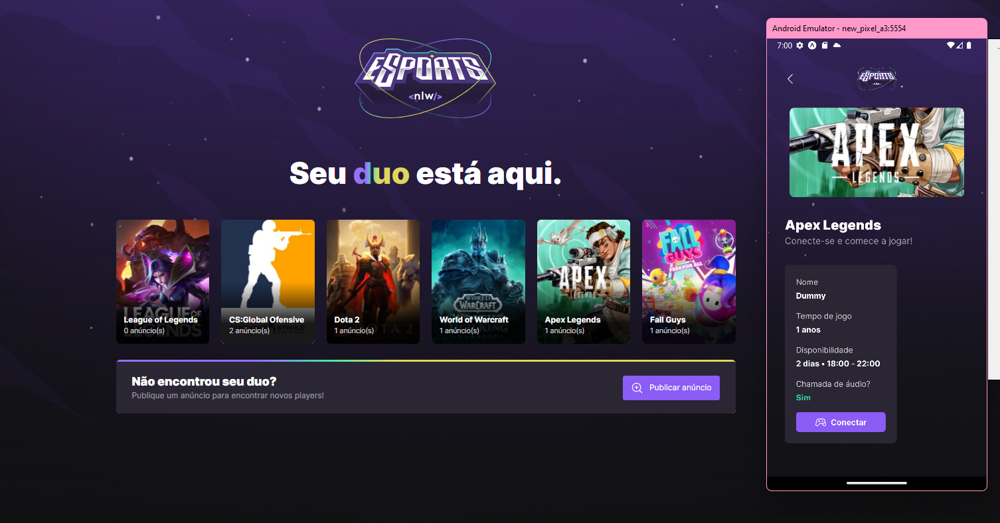

 

# Find your DUO

Project developed at Rocketseat's NLW eSports on the Ignite trail.

## About

App developed for web and mobile to find your DUO to play together your favorite game.

### Preview

### Tools used in project

- Javascript
- Typescript
- Express
- Prisma Db
- React (Vite)
- React Native
- Expo
- Tailwind Css
- Radix Ui

### Project run

After cloning the project, run the following commands:

### Server directory

- npm install or yarn to install all packages
- prisma migrate dev
- npm run dev or yarn dev to start the server

### Web app directory

**Server must be running!**

- npm install or yarn to install all packages
- npm run dev or yarn dev to start the app

### Mobile

- npm install or yarn to install all packages
- expo start

_You have to install Expo Go on your mobile to use the QRCode created when expo starts in terminal. If you are using an emulator, run it before expo start command, and after the expo starts, you can press A button._
